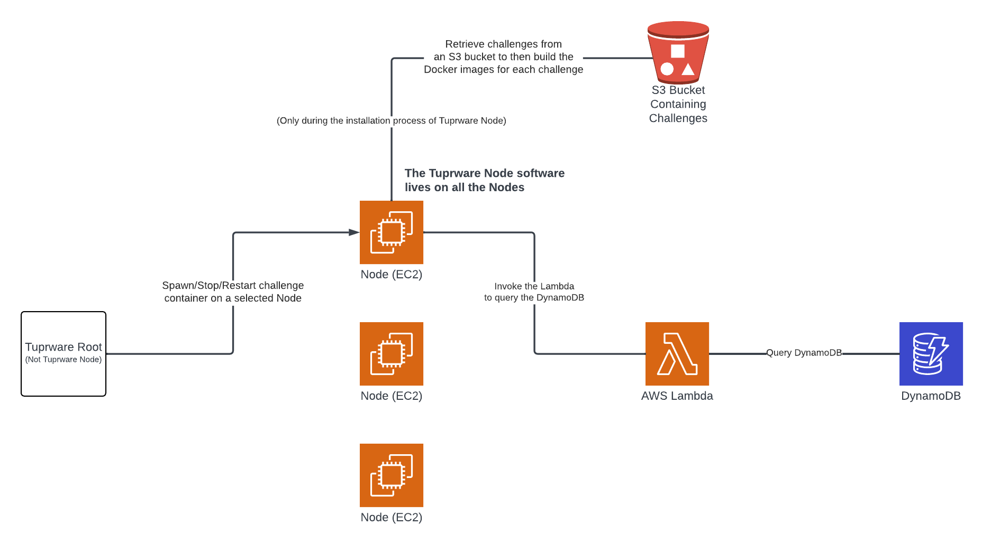

# Official Tuprware Node Documentation

## Table of Contents
1. [Installation](#installation)
    1. [Installing Tuprware Node on a selected node](#installing-tuprware-node-on-a-selected-node)
    2. [Setting up the proper AWS resources](#setting-up-the-proper-aws-resources)
        1. [EC2](#ec2)
        2. [Lambda](#lambda)
        3. [S3](#s3)
        4. [DynamoDB](#dynamodb)
2. [The Architecture](#the-architecture)
3. [Controlling Challenge Containers](#container-operations)
    1. [Spawning challenge containers](#spawning-challenge-containers)
    2. [Stopping challenge containers](#stopping-challenge-containers)
    3. [Restarting challenge containers](#restarting-challenge-containers)
    4. [Container port mapping](#container-port-mapping)

## Installation

### Installing Tuprware Node on a selected node
1. Once logged into your Node, clone this repository.
2. If you have already [set up your AWS resources](#setting-up-the-proper-aws-resources), then run `./setup.sh`. Follow the intructions in the installer. You will be asked to input the name of your S3 bucket, along with the access key and secret key of the User you've previously created. 

### Setting up the proper AWS resources

For the future, we could use the [Serverless framework](https://www.serverless.com/) to programmatically generate and configure the AWS resources for Tuprware Node. For now, it must be done manually. 

#### Creating the required Users and Roles
1. Create a User with the following permission(s):
    1. `AmazonS3ReadOnlyAccess`
    2. `AWSLambdaRole`
2. The required Role will be created during the creation of your Lambda function. Information on its permissions will be given in the [Lambda](#lambda) section.

#### EC2
In Tuprware Node, an EC2 is considered a Node. You may select any instance type that fits your performance needs. 

In the EC2's security group, make sure you have the following security rules:
* Outbound Rules
    * All Traffic : `0.0.0.0/0`
* Inbound Rules
    * All TCP : `0.0.0.0/0`

Any additional security rules can be added such as restricting access to SSH (port 22), etc. 

#### Lambda

In Tuprware Node, we use a Lambda function to query the DynamoDB.

When creating your Lambda, make sure the runtime is set to `Python 3.10`.

Additionally, the role which you created/reused for the Lambda, must have the following permissions:
* `AmazonDynamoDBFullAccess`

To upload the code to your Lambda do the following:
1. Download the `lambda.zip` file from the [`dynamodb_lambda`](https://github.com/uocybersec/tuprware-node/tree/dynamodb_lambda) branch.
2. Upload the `lambda.zip` file to your Lambda in AWS. 

Your Lambda should now be updated with the proper code. 

#### S3

Tuprware Node uses an S3 bucket during the installation process. It pulls challenges from an S3 bucket and builds each of their Docker images. 

Create your S3 bucket however you desire. 

You only need to make sure:
* That the User attached to the S3 bucket is the User you were previously instructed to create. If you have not created the required Users and Roles, follow [these instructions](#creating-the-required-users-and-roles). 
* That each challenge is stored as a `.zip` file.
* That each challenge is numbered from `1.zip` to `N.zip` for N challenges. For example, if I had 3 challenges, I'd have `1.zip`, `2.zip`, and `3.zip`.
* When each `.zip` file is decompressed, there must be a `Dockerfile` used to build the Docker image of the challenge. 

#### DynamoDB

Create a table named `containers_spawned` with the partition key `user_id`.

## The Architecture

Tuprware Node heavily relies on AWS resources. Here is a diagram outlining it's architecture: 

### Important notes

Turpware Node can be installed on as many Nodes as desired. In this diagram, I chose 3 Nodes. 

The Tuprware Node software is installed on each Node to receive requests to spawn/stop/restart challenge containers. Tuprware Root is the interface which sends said requests to the nodes. Tuprware Root is NOT the same as Tuprware Node. 

**This repository contains the code for Tuprware Node.** 

## Container Operations

### Spawning challenge containers

### Stopping challenge containers

### Restarting challenge containers

### Container port mapping